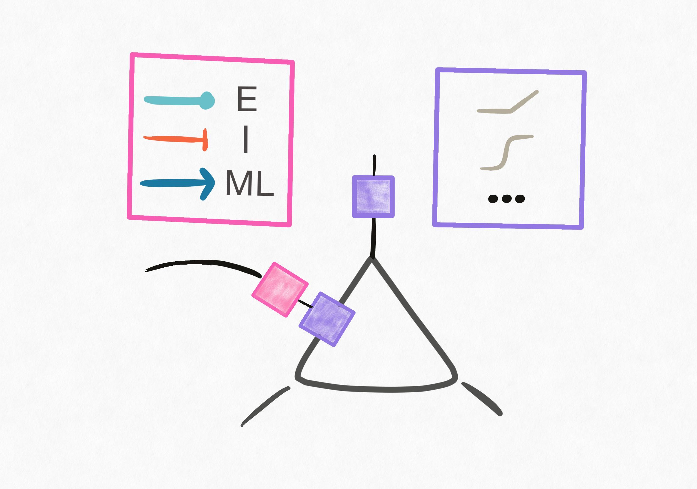
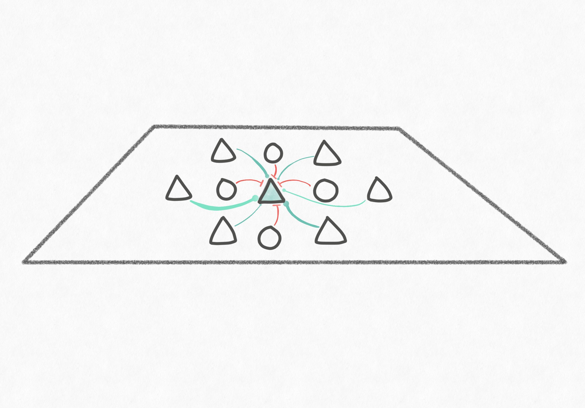
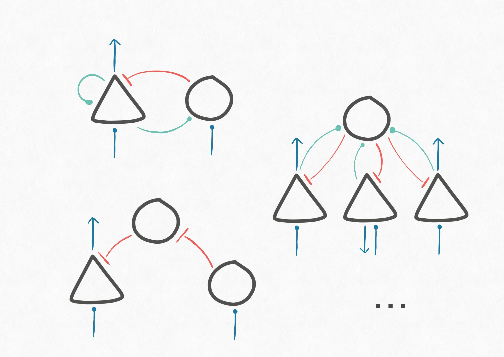
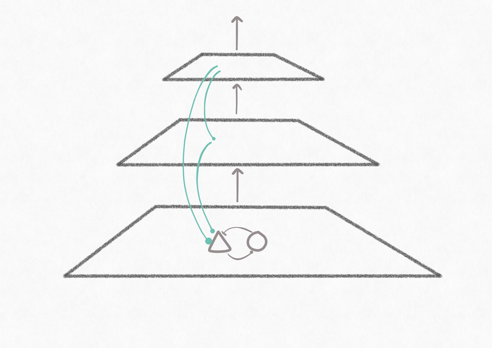

# `torch-biopl`: Biologically-plausible networks made easy

## Overview
* We provide our general philosophy and an overview of the functionalities supported in `torch-biopl` below. This is a growing list, so if you have any suggestions please don't hesitate to get in contact.

* There are several applications for which you, as a neuroscientist, would want to build a model for. We have done some preliminary work in providing a few example use cases as utilities. These come with instructions on how to create/access relevant datasets (+ accompanying dataloaders) and models. This list is by no means exhaustive but merely a starting point to fuel your imagination.

* To get started, jump to [installation](install.md) and then take a look at the examples provided.

## Motivation
The neuroscience community has varying modeling needs. On one hand, the more *functional* deep-learning based models are less biologically aligned and do not support testing mechanistic hypotheses. On the other hand, instantiating neural architectures that work at scale (on realistic sensory inputs) requires the practitioner to be overly techinically adept. Our motivation was to bridge these worlds.

In this package, we provide a basic set of features that will enable to user to construct biologically-realistic neural networks with minimal effort. At a glance, here are some of the main capabilities supported:

-   __Cell-type specification__

    ---

    <figure markdown="span">
    { width="300" }
    <figcaption>Synapses can adhere to Dale's law. Specify synapse- vs neuron-specific nonlinearities.</figcaption>
    </figure>
    [:octicons-arrow-right-24: Example](examples/advance_configs.md)

-   __Spatially embedded populations__

    ---

    <figure markdown="span">
    { width="300" }
    <figcaption>Construct hierarchical populations of spatially embedded neurons.</figcaption>
    </figure>
    [:octicons-arrow-right-24: Example](examples/basic_spatial_example.md)

-   __Microcircuit archetypes__

    ---

    <figure markdown="span">
    { width="300" }
    <figcaption>Learnable scaffolds for local "microcircuit" patterns of connectivity.</figcaption>
    </figure>
    [:octicons-arrow-right-24: Example](examples/advance_configs.md)

-   __Diverse feedback wiring__

    ---

    <figure markdown="span">
    { width="300" }
    <figcaption>Various specifications for inter-areal feedback projections.</figcaption>
    </figure>
    [:octicons-arrow-right-24: Example](examples/advance_configs.md)

-   __Connectome constrained modelling__

    ---

    <figure markdown="span">
    { width="300" }
    <figcaption>Efficient implementation of sparse-matrix arithmetic for forward and backpropagation.</figcaption>
    </figure>
    [:octicons-arrow-right-24: Example](examples/connectome_backward.md)

